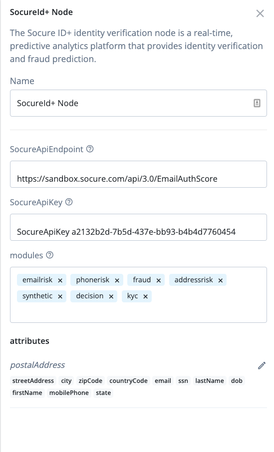

<!--
 * The contents of this file are subject to the terms of the Common Development and
 * Distribution License (the License). You may not use this file except in compliance with the
 * License.
 *
 * You can obtain a copy of the License at legal/CDDLv1.0.txt. See the License for the
 * specific language governing permission and limitations under the License.
 *
 * When distributing Covered Software, include this CDDL Header Notice in each file and include
 * the License file at legal/CDDLv1.0.txt. If applicable, add the following below the CDDL
 * Header, with the fields enclosed by brackets [] replaced by your own identifying
 * information: "Portions copyright [year] [name of copyright owner]".
 *
 * Copyright 2022 ForgeRock AS.
-->
# SocureId+ Identity Verification Node

An Identify Verification node for ForgeRock's [Identity Platform][forgerock_platform] 7.2.0 and above. Socure’s revolutionary ID+ platform utilizes every element of identity, natively orchestrated by advanced AI/ML, to maximize accuracy, reduce false positives, and eliminate the need for disparate products. 

##What's in the package
Once built and dropped into ForgeRock, 2 nodes will be available.

###SocureID+ authentication Node
    Verifies collected user attribute using SocureID+ api and returns the decision 
###Socure's Predictive Docv Node
    Verifies the user document and returns the collected data 
## Installations Steps

Copy the .jar file from the ../target directory into the ../web-container/webapps/openam/WEB-INF/lib directory where AM is deployed.  Restart the web container to pick up the new node.  The node will then appear in the authentication trees components palette.

**USAGE HERE**

##User Journeys

The Socure/ForgeRock integration user journey supports both Identity Verification and Identity proofing.

Use Case : User registration flow

**SCREENSHOTS ARE GOOD LIKE BELOW**

The code in this repository has binary dependencies that live in the ForgeRock maven repository. Maven can be configured to authenticate to this repository by following the following [ForgeRock Knowledge Base Article](https://backstage.forgerock.com/knowledge/kb/article/a74096897).

Configuration:

## Configure SocureID+ Node
 SocureAPIEndpoint : Socure's endpoint detail available on developer.socure.com 

Socure API key : Follow these steps to obtain API key

To begin using Socure ID+, register online with Socure to obtain an API key, configure the API key, and then set up the ID+ module.
This guide walks you through the required steps.
##Step 1: Register with Socure
1. Open https://dashboard.socure.com and select Create Account.
2. Enter your name and contact information. Create a password, select an industry, and click Submit when ready. You will receive a confirmation email from Socure.
3. Contact Socure’s Customer Service team to confirm your account has been set up.
4. Log in to your account at https://dashboard.socure.com.
5. Select Developers menu item and then ID+ Keys section
6. In the API Keys section, all API Keys associated with either your production, certification or sandbox are shown.
a. Copy the production key.
7. In the IPs & Domains section, update the Allowed Domains field and set it to 0.0.0.0/1
8. Click Update to save your changes.

Modules : configure list of mobiles required to run on input user attributes. 

Attributes : Map for picking ForgeRockLDAP Attributes to ID+ Api. The KEY should be the Socure attribute JSON key and the VALUE should be the corresponding ForgeRock LDAP Attribute.

 
##Configure Socure Predictive Docv

Socure API endpoint : get the endpoint detail from your socure account https://dashboard.socure.com/

Socure API key : Get the socure Api key from the https://dashboard.socure.com account as described in SocureID+ configuration guide

Socure web Api key : Get the web sdk Api key from the https://dashboard.socure.com account as described in SocureID+ configuration guide

Web SDK URL : https://websdk.socure.com/bundle.js use this value for latest web sdk integration.

